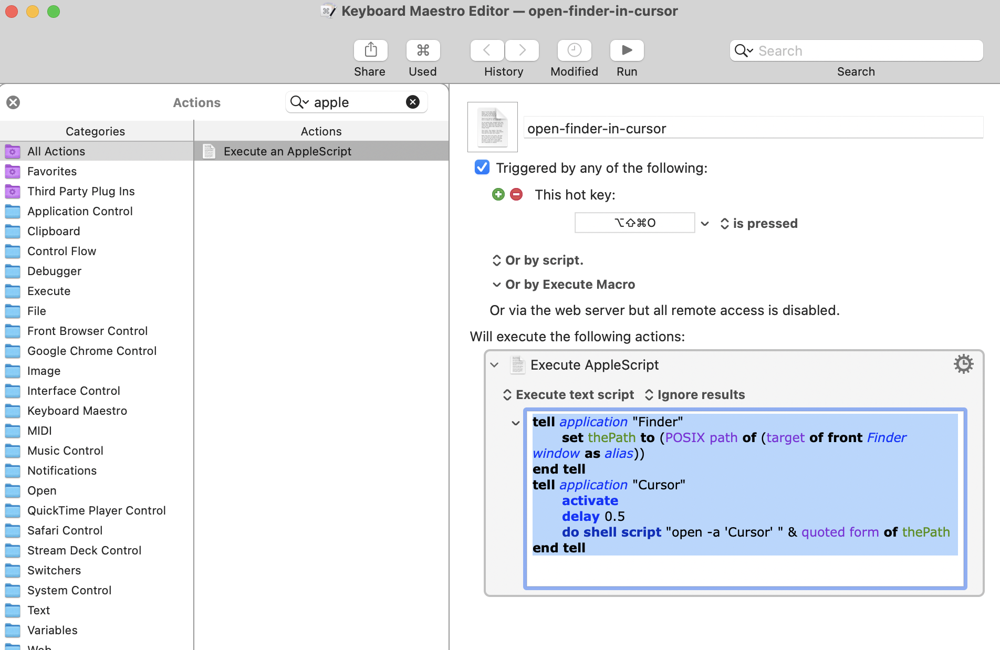

# Protocol
1. copy `.zshrc` to home dir and make sure `export PATH=$PATH:/opt/homebrew/bin` is in `$PATH`

## Homebrew
2. install homebrew:

```
/bin/bash -c "$(curl -fsSL https://raw.githubusercontent.com/Homebrew/install/HEAD/install.sh)"
```

## Install script
3. install applications using `new-computer-install.sh`

## Manual install of mac apps
*check to see if brew casks exist for these (make sure to choose the old versions you purchased)*

   - magnet
   - daisydisk
   - better rename 9
   - audionote
   - cleanmymac (sub)
   - anki
   - slack
   - screenfloat

# Dev environment
4. open iTerm and install default profile
5. sign into VSCode and install extensions
6. sign into Cursor and transfer VSCode settings
7. connect github account to VScode/cursor so you can commit stuff
```sh
git config --global user.name "oliveroliverio"
git config --global user.email oliveroliverio@gmail.com
```

## VScode paste image extension settings
Paste Image - Mushan v1.0.4
- paste image: base path: `${projectRoot}`
- paste image: default name: `YMMDD_HH-mm-ss`
- paste image: path: `${projectRoot}/zz-img`
- paste image: prefix: `/`
- ~~paste image: default name: `${currentFileDir}_YMMDD_HH-mm-ss`~~
- ~~paste image: name prefix: `${currentFileDir}_`~~


## Markdown Preview Enhanced settings
shd101wyy
- need to install [princexml](https://www.princexml.com/download/15/) to enable export to PDF


## Keyboard Maestro and custom shortcuts
8.  open keyboard maestro and make a `open-in-cursor` shortcut
9.  disable default keyboard maestro shortcuts:  `search the web`: `

## Scrp-wrk specific
10. use Scorpion self service app to install: Scinamic, Chemdraw, D360, fortclient vpn, printer drivers, microsoft office suite, the unarchiver
    - D360 url: `d360.scorpiontx.com:8080`
    - chemdraw activation code: `C387-38A1-A02C-D6DE`.  Email: `ooliverio@scorpiontx.com`
    - prism: refer to last pass machine code and serial

## Other
10. sign into lastpass
11.  open notion, sign in and sync
12. adobe creative cloud: illustrator


# CS-Py: Setting up VSCode for python

https://www.youtube.com/watch?v=zulGMYg0v6U

1. open folder w/ vs code
2. save workspace file
3. extensions
    1. python extension pack: LeoJhonSong
    2. pylance: microsoft
    3. jupyter
    4. path intellisense
    5. material icon theme


---
# Code/scripts

## .zshrc
```bash
# The next line updates PATH for egcli command.
if [ -f '/Users/ooliverio/Library/Group Containers/FELUD555VC.group.com.egnyte.DesktopApp/CLI/egcli.inc' ]; then . '/Users/ooliverio/Library/Group Containers/FELUD555VC.group.com.egnyte.DesktopApp/CLI/egcli.inc'; fi


alias ls='ls -ahG'
alias sdf="pwd | tr -d '\n' | pbcopy"
alias home='cv ~'
alias up='cv ..'
alias h='history'
alias python="python3"


#sudo chown -R $USER /usr/local/include
export PATH=$PATH:~/software/circos/current/bin:$PATH
if [ -z $DISPLAY ]; then export DISPLAY=:0.0; fi


export PATH=$PATH:/Users/oliveroliverio/GoogleDrive/Git
export PATH=$PATH:/opt/homebrew/bin
export PATH=$PATH:/Users/oliveroliverio/Dropbox/Z_DEV


function cv()
{
if [ $# -eq 0 ]; then
cd && ls -haG
else
cd "$*" && ls -haG
fi
}
alias cd='cv'


PATH=~/.console-ninja/.bin:$PATH
```

## new-computer-install.sh
```sh
#!/bin/bash

# Function to check if Homebrew is installed
check_homebrew() {
  if ! command -v brew &>/dev/null; then
    echo "Homebrew is not installed. Installing Homebrew..."
    /bin/bash -c "$(curl -fsSL https://raw.githubusercontent.com/Homebrew/install/HEAD/install.sh)"
  else
    echo "Homebrew is already installed."
  fi
}

# Ensure Homebrew is installed
check_homebrew

# Update Homebrew
echo "Updating Homebrew..."
brew update

# Install packages
echo "Installing command-line packages..."

brew install node
brew install git


# Install GUI applications (casks)
echo "Installing GUI applications..."

brew install --cask iterm2
brew install --cask visual-studio-code
brew install --cask obs
brew install --cask postman
brew install --cask postman-agent
brew install --cask sublime-text
brew install --cask papers
brew install --cask lastpass
brew install --cask cursor
brew install --cask adobe-creative-cloud
brew install --cask vlc
brew install --cask notion


#---------------double check earlier versions----------
brew install --cask bartender
brew install --cask keyboard-maestro


# Finished installation
echo "All installations completed successfully!"


```

## Keyboard Maestro
`open-in-cursor`
```applescript
tell application "Finder"
	set thePath to (POSIX path of (target of front Finder window as alias))
end tell
tell application "Cursor"
	activate
	delay 0.5
	do shell script "open -a 'Cursor' " & quoted form of thePath
end tell

```


---
# Useful shortcuts
